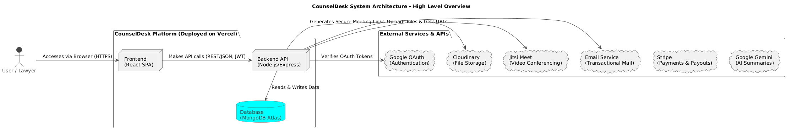

# CounselDesk: AI-Powered Legal Services Platform

CounselDesk is a modern, **full-stack web application** designed to bridge the gap between clients and legal professionals.  
It provides a comprehensive platform for lawyers to manage their practice and for users to find legal help, book appointments, and use **AI-powered legal tools**.

This monorepo contains the **complete frontend, backend, and data-seeding projects** that together power the CounselDesk platform.

---

## 🚀 Live Demo & Demo Accounts

The project is live and deployed on **Vercel**. You can explore full functionality using the demo accounts below.

- **Live Project:** [https://counsel-desk.vercel.app/](https://counsel-desk.vercel.app/)

### One-Click Demo Logins

- **Log in as a Demo User:** [https://counsel-desk.vercel.app/demo/user](https://counsel-desk.vercel.app/demo/user)
- **Log in as a Demo Lawyer:** [https://counsel-desk.vercel.app/demo/lawyer](https://counsel-desk.vercel.app/demo/lawyer)

| Role       | Email                                                             | Password |
|------------|-------------------------------------------------------------------|-----------|
| **User**   | [demouser@counseldesk.com](mailto:demouser@counseldesk.com)       | Counsel@123 |
| **Lawyer** | [demolawyer@counseldesk.com](mailto:demolawyer@counseldesk.com)   | Counsel@123 |

---

## ✨ Key Features

- **Role-Based Dashboards:** Independent secured dashboards for **Users**, **Lawyers**, and **Admins**.
- **Stripe Payment & Payouts:** Integrated with **Stripe Checkout** for user payments and **Stripe Connect** for lawyer payouts with platform fee-splitting (95% lawyer / 5% platform).
- **Live Video Conferencing:** Seamless one-on-one video meetings powered by **Jitsi Meet**.
- **AI Legal Tools:**  
  - *Legal Code Explorer:* Search and browse Indian legal codes.  
  - *AI Summary:* On-demand summarization of legal text using **Google Gemini API**.
- **Legal Q&A Forum:** Ask, answer, vote, and mark “Best Answer” in an interactive Q&A environment.
- **Full Admin Panel:** Manage users, verify lawyers, and view analytics via a unified interface.
- **Cloud Storage:** Secure integration with **Cloudinary** for user-uploaded files.
- **Automated Cron Jobs:** Daily backend tasks (like updating slots, marking completed appointments) are automated via **Vercel Cron Jobs**.

---

## 🏛️ System Architecture

Below is a high-level conceptual overview of the platform architecture — detailing how each component interacts.



---

## 📁 Repository Structure

This repository is organized as a **monorepo** with the following structure:
```bash
/
|-- /backend # Node.js, Express & MongoDB backend API
|-- /docs # Diagrams, architectural documentation
|-- /frontend # React (Vite) single-page application
|-- README.md # Project overview
```


### Directory References

- **/backend:** Complete server-side logic.  
  Refer to [backend/README.md](./backend/README.md) for setup and API documentation.
- **/frontend:** Client-side (React + Vite) SPA with multi-role interfaces.  
  See [frontend/README.md](./frontend/README.md) for setup and component structure.

---

## 🧩 How to Run Locally

To run the platform locally, you need to start **both the backend and frontend** projects in separate terminals.

> **Note:** Environment variable setup is detailed inside `backend/README.md` and `frontend/README.md`.

### 1. Run the Backend
```bash
# Navigate to the backend folder
cd backend

# Install dependencies
npm install

# Create a .env file and add your secret keys
# (Refer to backend/README.md for the full list)
touch .env

# Run the server
npm run dev
# Server will be running at http://localhost:3000
```

### 2. Run the Frontend
```bash
# Open a new terminal and navigate to the frontend folder
cd frontend

# Install dependencies
npm install

# Create a .env file and add your keys
touch .env
echo "VITE_BACKEND_URL=http://localhost:3000" > .env
echo "VITE_GEMINI_API_KEY=your_gemini_key_here" >> .env

# Run the server
npm run dev
# App will be available at http://localhost:5173
```


---

## 🧠 Technology Summary

| Layer | Key Technologies |
|-------|------------------|
| **Frontend** | React 18, Vite, Tailwind CSS, React Query, Stripe.js, Jitsi Meet |
| **Backend** | Node.js, Express.js, MongoDB, JWT Auth, Stripe API |
| **AI Layer** | Google Gemini API |
| **Deployment** | Vercel (Serverless Functions + Cron) |
| **Storage** | Cloudinary |
| **Version Control** | Git + GitHub (Monorepo) |

---

## 👥 Meet the Team

| Name                                                   | Role | 
|--------------------------------------------------------|------|
| **[Aayush Kukreja](https://github.com/Aayush6377)**    | Lead Developer (Frontend & Backend) |
| **[Sushil Gupta](https://github.com/SGgithub001)**     | Backend Development & Testing |
| **[Sankit Singhal](https://github.com/SankitSinghal)** | Research & Concept Development |
| **[Rahul Mandal](https://www.linkedin.com/in/rahulmandal2002)**                                   | Research Assistance |
---

## 🧾 License

This project is maintained exclusively for educational and demonstration purposes.  
All assets and features comply with open-source frameworks and APIs under public usage terms.

---

## 💬 Contact

For collaboration or queries:

**Email:** [aayushkukreja0104@gmail.com](mailto:aayushkukreja0104@gmail.com)  
**Project Lead:** Aayush Kukreja

---


